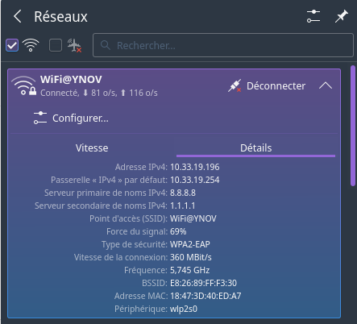
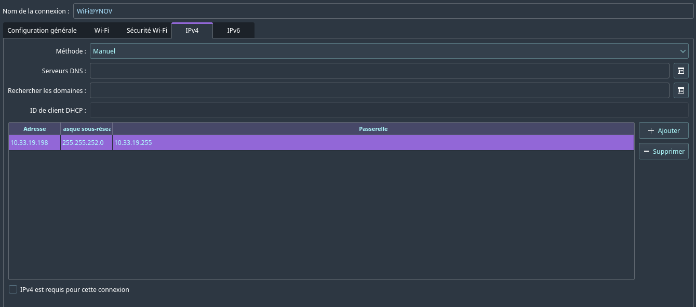

<h1 align="center" >TP1 : Mise en jambes</h1>

## Sommaire

## I. Exploration locale en solo

### 1. Affichage d'informations sur la pile TCP/IP locale

<br/>

#### **En CLI**

🌞 Affichez les infos des cartes réseau de votre PC

```sh
$ ip a | tail - 6

2: wlp2s0: <BROADCAST,MULTICAST,UP,LOWER_UP> mtu 1500 qdisc noqueue state UP group default qlen 1000
    link/ether 18:47:3d:40:ed:a7 brd ff:ff:ff:ff:ff:ff
    inet 10.33.19.196/22 brd 10.33.19.255 scope global dynamic noprefixroute wlp2s0
       valid_lft 76539sec preferred_lft 76539sec
    inet6 fe80::4797:2966:8eb9:6c1e/64 scope link noprefixroute
       valid_lft forever preferred_lft forever
```

- Le nom de l'interface est donc `wlp2s0` (ligne 1)
- Son adresse MAC est `18:47:3d:40:ed:a7` (ligne 3)
- Son adresse IP est `10.33.19.196/22` (ligne 4)

🌞 Affichez votre gateway

```sh
$ ip r
default via 10.33.19.254 dev wlp2s0 proto dhcp src 10.33.19.196 metric 600
10.33.16.0/22 dev wlp2s0 proto kernel scope link src 10.33.19.196 metric 600
```

La gateway est `10.33.19.254`
<br/>
<br/>

#### **En graphique**

🌞 Trouvez comment afficher les informations sur une carte IP (change selon l'OS)



Donc dans les détails, l'adresse IP est noté en ligne 1,<br>
La passerelle en ligne 2<br/>
Et l'adresse MAC en avant-dernière ligne (ligne 11)
<br/>
<br/>

#### **Questions**

🌞 À quoi sert la gateway dans le réseau d'YNOV ?

La gateway sert à faire le lien entre les réseaux locaux et les réseaux internet.
<br/>
<br/>

### 2.Modifications des informations

#### A. Modification d'adresse IP (part 1)

<br/>
🌞 Utilisez l'interface graphique de votre OS pour changer d'adresse IP :



Pour changer d'adresse IP graphiquement, il faut aller dans les paramètres de la connexion, passer la méthode d'automatique à manuelle, puis rentrer l'adresse IP, le masque de sous-réseau et la passerelle.

<br/>

🌞 Il est possible que vous perdiez l'accès internet. Pourquoi ?

Parce que l'adresse IP choisie peut être déjà utilisé par un autre ordinateur, ce qui empêche au routeur d'envoyer les requêtes à ce second ordinateur.
<br/>
<br/>

## III. Manipulations d'autres outils/protocoles côté client

### 1. DHCP

🌞 Exploration du DHCP, depuis votre PC

- Afficher l'adresse IP du serveur DHCP du réseau WiFi YNOV

Pour le trouver, j'ai voulu utiliser le fichier `.leases` situé (sous Manjaro) dans `/var/lib/dhclient/` avec comme nom `dhclient.<interface>.leases`.

Mais je ne l'avais pas. Pour le créer, j'ai donc fait:

```sh
$ sudo dhclient -d -nw wlp2s0

Internet Systems Consortium DHCP Client 4.4.3
Copyright 2004-2022 Internet Systems Consortium.
All rights reserved.
For info, please visit https://www.isc.org/software/dhcp/

Listening on LPF/wlp2s0/18:47:3d:40:ed:a7
Sending on   LPF/wlp2s0/18:47:3d:40:ed:a7
Sending on   Socket/fallback
DHCPREQUEST for 10.33.18.142 on wlp2s0 to 255.255.255.255 port 67
DHCPACK of 10.33.18.142 from 10.33.19.254
RTNETLINK answers: File exists
bound to 10.33.18.142 -- renewal in 37385 seconds.
```

Maintenant que le fichier est généré, on peut déjà l'afficher:

```sh
$ sudo more /var/lib/dhclient/dhclient.wlp2s0.leases

lease {
  interface "wlp2s0";
  fixed-address 10.33.18.142;
  option subnet-mask 255.255.252.0;
  option dhcp-lease-time 86400;
  option routers 10.33.19.254;
  option dhcp-message-type 5;
  option dhcp-server-identifier 10.33.19.254;
  option domain-name-servers 8.8.8.8,8.8.4.4,1.1.1.1;
  renew 3 2022/09/28 19:29:21;
  rebind 4 2022/09/29 04:45:37;
  expire 4 2022/09/29 07:45:37;
}
lease {
  interface "wlp2s0";
  fixed-address 10.33.18.142;
  option subnet-mask 255.255.252.0;
  option routers 10.33.19.254;
  option dhcp-lease-time 86132;
  option dhcp-message-type 5;
  option domain-name-servers 8.8.8.8,8.8.4.4,1.1.1.1;
  option dhcp-server-identifier 10.33.19.254;
  renew 3 2022/09/28 18:13:11;
  rebind 4 2022/09/29 04:46:11;
  expire 4 2022/09/29 07:45:38;
}
(END)
```

Pour trouver l'adresse IP du serveur DHCP on peut donc utiliser `grep`:

```sh
$ sudo grep "dhcp-server" /var/lib/dhclient/dhclient.wlp2s0.leases

  option dhcp-server-identifier 10.33.19.254;
```

On peut donc voir que l'adresse IP est `10.33.19.254`;
<br/>
<br/>

- Cette adresse a une durée de vie limitée. C'est le principe du bail DHCP (ou DHCP lease). Trouver la date d'expiration de votre bail DHCP

Dans ce même fichier, on peut voir `expire` suivi d'une date:

```sh
$ sudo grep "expire" /var/lib/dhclient/dhclient.wlp0s2.leases

  expire 4 2022/09/29 07:45:38;
```

La date d'expiration est donc pour demain à 07h45.

### 2. DNS
